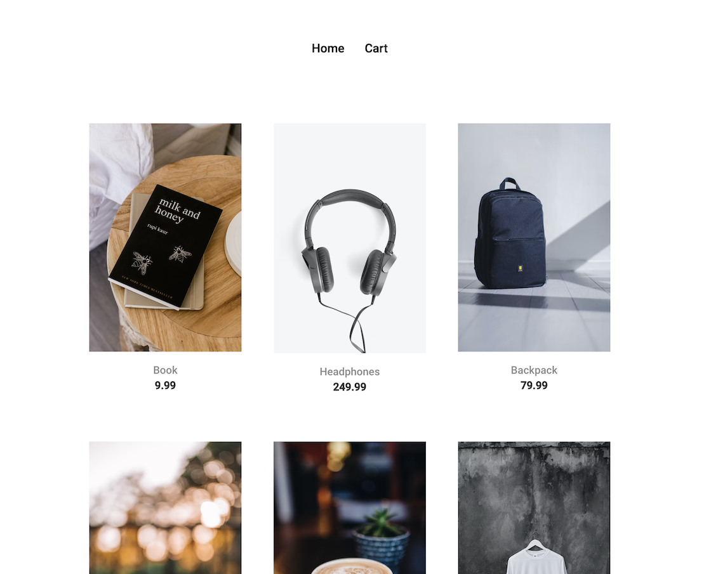
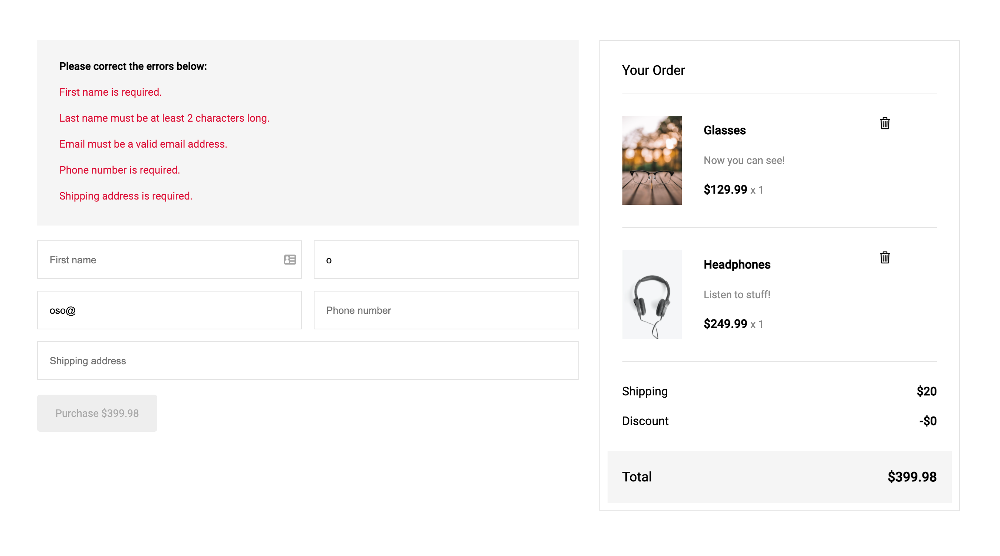

#### My Store Project

This project was initially generated with [Angular CLI](https://github.com/angular/angular-cli) version 13.0.2.

#### Summary
> In this project, I will use Angular to create a simple single-page e-commerce application called MyStore.
> The application will include a variety of Angular components that communicate with one another, such as a product list component that displays a list of items for which a user can shop.
> The mock data is generated from the provided static json file, and the items are then rendered into the page.

#### Run the project

Run `ng serve` OR `npm start` for a dev server. Navigate to `http://localhost:4200/`. The app will automatically reload if you change any of the source files.

#### Build the project

Run `ng build` OR `npm run build` to build the project. The build artifacts will be stored in the `dist/` directory.

#### Screenshot

